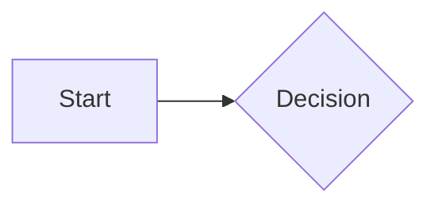

import { Callout, TabGroup, Steps, Step, FileTree, MermaidDiagram } from 'revitedocs/components'

ReviteDocs provides built-in components and supports custom MDX components.

## Built-in Components

### Callout

Display important information with callouts:

<Callout variant="info" title="Information">
  This is informational content that helps users understand a concept.
</Callout>

<Callout variant="tip" title="Pro Tip">
  Helpful tips that improve the user experience.
</Callout>

<Callout variant="warning" title="Warning">
  Something to be careful about when using this feature.
</Callout>

<Callout variant="danger" title="Danger">
  Critical warning - this action cannot be undone!
</Callout>

**Usage:**

```jsx
<Callout variant="info" title="Information">
  This is informational content.
</Callout>
```

**Available variants:** `info`, `tip`, `warning`, `danger`, `note`

### TabGroup

Organize content in tabs:

<TabGroup labels={['npm', 'yarn', 'pnpm']}>
  <div>

```bash
npm install revitedocs
```

  </div>
  <div>

```bash
yarn add revitedocs
```

  </div>
  <div>

```bash
pnpm add revitedocs
```

  </div>
</TabGroup>

**Usage:**

```jsx
<TabGroup labels={['npm', 'yarn', 'pnpm']}>
  <div>npm install revitedocs</div>
  <div>yarn add revitedocs</div>
  <div>pnpm add revitedocs</div>
</TabGroup>
```

### MermaidDiagram

Create diagrams with Mermaid:

<MermaidDiagram chart={`
graph LR
    A[Start] --> B{Decision}
    B -->|Yes| C[Action 1]
    B -->|No| D[Action 2]
    C --> E[End]
    D --> E
`} />

**Usage:**

~~~jsx
<MermaidDiagram chart={`
graph LR
    A[Start] --> B{Decision}
    B -->|Yes| C[Action 1]
    B -->|No| D[Action 2]
`} />
~~~

Or in markdown files with fenced code blocks:

~~~markdown

~~~

### Steps

Show sequential steps:

<Steps>
  <Step number={1}>
    **Install the package**
    
    Run `npm install revitedocs` to add it to your project.
  </Step>
  <Step number={2}>
    **Create configuration**
    
    Add a config file at `.revitedocs/config.ts`.
  </Step>
  <Step number={3}>
    **Start development**
    
    Run `npm run dev` to start the dev server.
  </Step>
</Steps>

**Usage:**

```jsx
<Steps>
  <Step number={1}>First step content</Step>
  <Step number={2}>Second step content</Step>
  <Step number={3}>Third step content</Step>
</Steps>
```

### FileTree

Display directory structures:

<FileTree items={[
  'project/',
  '  src/',
  '    components/',
  '      Button.tsx',
  '      Card.tsx',
  '    index.ts',
  '  package.json',
  '  tsconfig.json'
]} />

**Usage:**

```jsx
<FileTree items={[
  'project/',
  '  src/',
  '    components/',
  '      Button.tsx',
  '    index.ts',
  '  package.json'
]} />
```

## Custom Components

### Using MDX

Create `.mdx` files to use React components directly:

```jsx
import { MyButton } from '../components/MyButton'

# My Page

<MyButton onClick={() => alert('Clicked!')}>
  Click Me
</MyButton>
```

### Component Slots

Override default layout components by creating files in `.revitedocs/theme/`:

<FileTree items={[
  '.revitedocs/',
  '  theme/',
  '    Header.tsx',
  '    Footer.tsx',
  '    Sidebar.tsx'
]} />

Example custom header:

```tsx
// .revitedocs/theme/Header.tsx
export default function Header({ title }) {
  return (
    <header className="custom-header">
      <h1>{title}</h1>
    </header>
  )
}
```

## Styling Components

Use Tailwind CSS classes in your components:

```tsx
export function Card({ children }) {
  return (
    <div className="p-4 rounded-lg border bg-white dark:bg-gray-800">
      {children}
    </div>
  )
}
```
