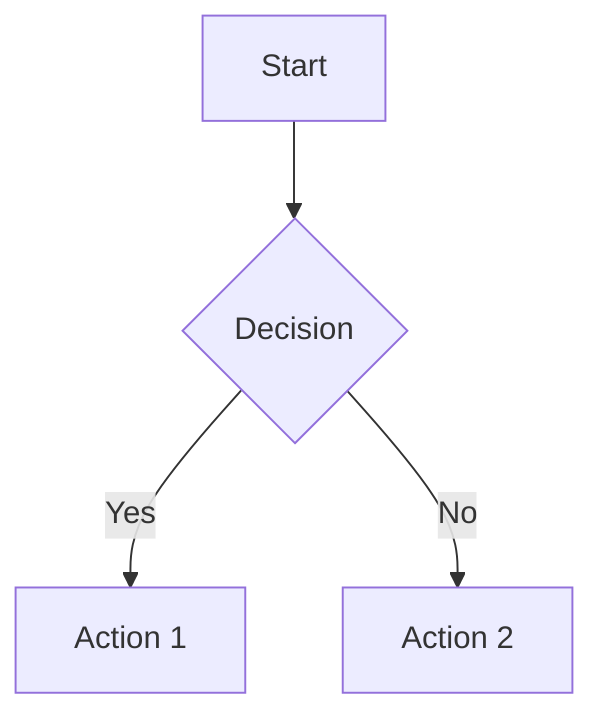

# ReviteDocs by DevObsessed

A modern documentation generator powered by React, Vite, and MDX with static site generation (SSG) support.

## Features

- ⚡️ **Vite-powered** - Lightning fast HMR and builds
- 📝 **MDX Support** - Write docs in Markdown with React components
- 🔍 **Full-text Search** - Powered by Pagefind
- 🎨 **Theming** - Customizable with Tailwind CSS
- 📊 **Mermaid Diagrams** - Built-in diagram support
- 🌐 **i18n Ready** - Multi-language documentation
- 📦 **Versioning** - Support for multiple doc versions
- 🤖 **LLM-friendly** - Auto-generates `llms.txt` for AI crawlers
- 🗺️ **SEO Ready** - Auto-generates sitemaps

## Quick Start

```bash
# Create a new docs project
npx revitedocs init

# Start development server
npx revitedocs dev

# Build for production
npx revitedocs build

# Preview production build
npx revitedocs preview
```

## Project Structure

```
docs/
├── .revitedocs/
│   ├── config.ts       # Configuration file
│   └── dist/           # Build output (after build)
├── getting-started/
│   └── installation.md
├── guide/
│   └── introduction.md
└── index.md            # Homepage
```

## Configuration

Create `.revitedocs/config.ts` in your docs folder:

```typescript
import { defineConfig } from 'revitedocs'

export default defineConfig({
  title: 'My Docs',
  description: 'Documentation for my project',
  
  theme: {
    logo: '/logo.svg',
    nav: [
      { text: 'Guide', link: '/guide/' },
      { text: 'API', link: '/api/' },
    ],
    sidebar: {
      '/guide/': [
        {
          text: 'Getting Started',
          items: [
            { text: 'Installation', link: '/guide/installation' },
            { text: 'Quick Start', link: '/guide/quick-start' },
          ],
        },
      ],
    },
    socialLinks: [
      { icon: 'github', link: 'https://github.com/your/repo' },
    ],
  },
  
  // Optional: Enable versioning
  versions: ['v2', 'v1'],
  defaultVersion: 'v2',
  
  // Optional: Enable i18n
  locales: {
    en: { label: 'English', lang: 'en-US' },
    es: { label: 'Español', lang: 'es-ES' },
  },
  defaultLocale: 'en',
  
  // Optional: LLM configuration
  llms: {
    enabled: true,
    title: 'My Project Documentation',
    description: 'Complete documentation for My Project',
  },
})
```

## CLI Commands

### `revitedocs [root]` / `revitedocs dev [root]`

Start the development server.

| Option | Description | Default |
|--------|-------------|---------|
| `--port <port>` | Port number | `3000` |
| `--open` | Open browser on startup | `false` |
| `--host` | Expose to network | `false` |

### `revitedocs build [root]`

Build for production with SSG.

| Option | Description | Default |
|--------|-------------|---------|
| `--outDir <dir>` | Output directory | `.revitedocs/dist` |
| `--base <path>` | Public base path | `/` |
| `--skip-ssg` | Skip SSG pre-rendering | `false` |
| `--skip-search` | Skip search index | `false` |
| `--skip-llms` | Skip llms.txt generation | `false` |
| `--skip-sitemap` | Skip sitemap.xml | `false` |
| `--site-url <url>` | Base URL for sitemap | - |

### `revitedocs preview [root]`

Preview the production build locally.

| Option | Description | Default |
|--------|-------------|---------|
| `--port <port>` | Port number | `4173` |
| `--outDir <dir>` | Output directory to preview | `.revitedocs/dist` |

### `revitedocs init`

Initialize a new revitedocs project with interactive prompts.

## MDX Components

Built-in components available in your MDX files:

### Callout

```mdx
<Callout type="info" title="Note">
  This is an informational callout.
</Callout>

<Callout type="warning">
  This is a warning without a title.
</Callout>
```

Types: `info`, `warning`, `error`, `tip`

### Tabs

```mdx
<TabGroup>
  <Tabs label="npm">
    ```bash
    npm install revitedocs
    ```
  </Tabs>
  <Tabs label="pnpm">
    ```bash
    pnpm add revitedocs
    ```
  </Tabs>
</TabGroup>
```

### Steps

```mdx
<Steps>
  <Step title="Install">
    Run `npm install revitedocs`
  </Step>
  <Step title="Configure">
    Create your config file
  </Step>
  <Step title="Build">
    Run `npm run build`
  </Step>
</Steps>
```

### FileTree

```mdx
<FileTree>
  - src/
    - components/
      - Button.tsx
      - Card.tsx
    - index.ts
  - package.json
</FileTree>
```

### Mermaid Diagrams

````mdx

````

### Badge

```mdx
<Badge>Default</Badge>
<Badge variant="success">Success</Badge>
<VersionBadge version="2.0.0" />
<StatusBadge status="stable" />
```

### Code Blocks

Syntax highlighting powered by Shiki with support for:
- Line highlighting: `{1,3-5}`
- Line numbers
- Title/filename display
- Copy button

## Frontmatter

```yaml
---
title: Page Title
description: Page description for SEO
---
```

## Programmatic API

```typescript
import { loadConfig, resolveConfig, defineConfig } from 'revitedocs'

// Load config from .revitedocs/config.ts
const config = await loadConfig('./docs')

// Resolve user config with defaults
const resolved = resolveConfig('./docs', { title: 'My Docs' })
```

## Requirements

- Node.js >= 18.0.0

## License

MIT — Brought to you by [DevObsessed](https://devobsessed.com)

